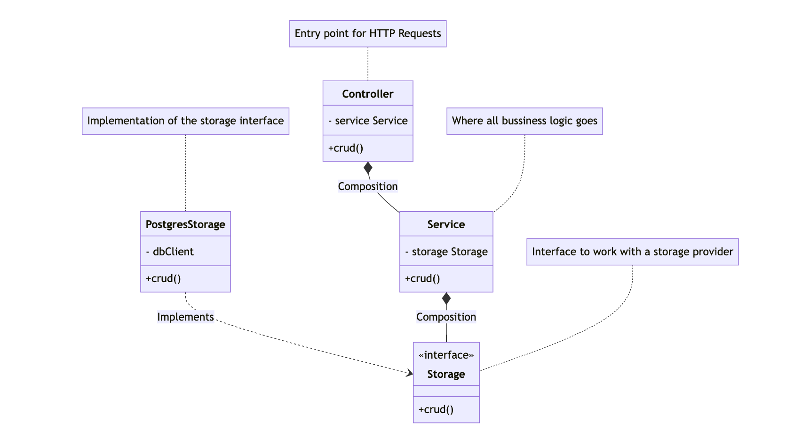

<p align="center">
  <a href="http://nestjs.com/" target="blank"></a>
</p>

[circleci-image]: https://img.shields.io/circleci/build/github/nestjs/nest/master?token=abc123def456

[circleci-url]: https://circleci.com/gh/nestjs/nest

  <p align="center">A progressive <a href="http://nodejs.org" target="_blank">Node.js</a> framework for building efficient and scalable server-side applications.</p>
    <p align="center">
<a href="https://www.npmjs.com/~nestjscore" target="_blank"></a>
<a href="https://www.npmjs.com/~nestjscore" target="_blank"></a>
<a href="https://www.npmjs.com/~nestjscore" target="_blank"></a>
<a href="https://circleci.com/gh/nestjs/nest" target="_blank"></a>
<a href="https://coveralls.io/github/nestjs/nest?branch=master" target="_blank"></a>
<a href="https://discord.gg/G7Qnnhy" target="_blank"></a>
<a href="https://opencollective.com/nest#backer" target="_blank"></a>
<a href="https://opencollective.com/nest#sponsor" target="_blank"></a>
  <a href="https://paypal.me/kamilmysliwiec" target="_blank"></a>
    <a href="https://opencollective.com/nest#sponsor"  target="_blank"></a>
  <a href="https://twitter.com/nestframework" target="_blank"></a>
</p>
  <!--[](https://opencollective.com/nest#backer)
  [](https://opencollective.com/nest#sponsor)-->

## Description

Work Ride is a versatile transportation and payment management application that enhances efficiency for businesses by
recording trips, driver rates, and accurately calculating distances between employees and offices. It streamlines
transportation logistics, enabling businesses of all sizes to optimize their operations and reduce costs associated with
employee commuting.

### TODOs

1. Standardize response objects
2. Set up a custom logger
3. Fix Dependency Inversion between providers of different modules

## Hexagonal Arquitecture

The project was made using this architecture which consists of 3 layers to decompose our code

1. Domain
    2. We can see it as the representation of information of every functionality/table in our app
   3. We use this layer to declare the objects needed for the CRUDs operation, reports, etc
2. Application
    3. All the bussiness logic related to the app goes in here, for example, calculating rates between an employee and
       an office, auth, etc
   4. We use it to do validations, calculations, etc
3. Infrastructure
    4. Any external service from our app goes here, for example the database(postgres, mysql, etc), email provider(
       sendinblue, resend, etc), chat messaging app (slack, whatsapp)
   5. We use it to implement our database system provider (postgres)
       

## Installation

```bash
$ npm install
```

### Database

```bash
# install postgres
docker compose up -d
```

```bash
# enter the psql console to create the role and db
docker exec -it postgres psql -U postgres

# being inside psql execute the next commands:

# create the user role
CREATE ROLE workride WITH LOGIN PASSWORD 'workride';

# create the db
CREATE DATABASE workride WITH OWNER workride;

```

Execute the sql migrations and seeds inside `src/database/sqlmigrations` and `src/database/seed` manually or with a tool
like [migrations](https://github.com/alexyslozada/migrations).

### Environments

Create a `.env` file in the root of the project

```bash
cp .env.example .env
```

## Running the app

```bash
# development
$ npm run start

# watch mode
$ npm run start:dev

# production mode
$ npm run start:prod
```

## Api doc

You can see the endpoints doc in here [Postman Doc](https://documenter.getpostman.com/view/8285806/2s9YC4VZ3N)

## Support

Nest is an MIT-licensed open source project. It can grow thanks to the sponsors and support by the amazing backers. If
you'd like to join them, please [read more here](https://docs.nestjs.com/support).

## Stay in touch

- Author - [Kamil Myśliwiec](https://kamilmysliwiec.com)
- Website - [https://nestjs.com](https://nestjs.com/)
- Twitter - [@nestframework](https://twitter.com/nestframework)

## License

Nest is [MIT licensed](LICENSE).
